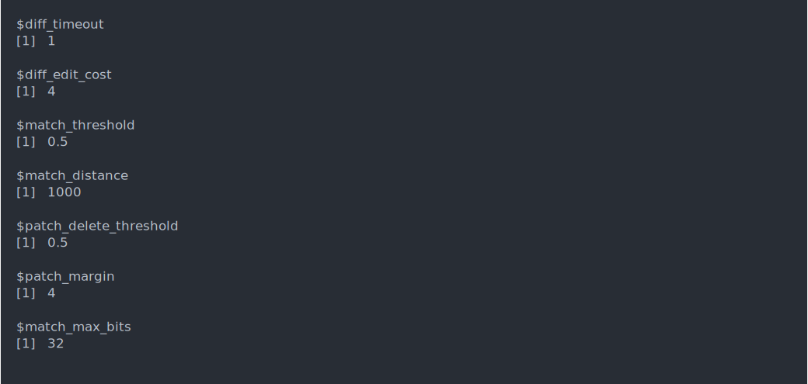
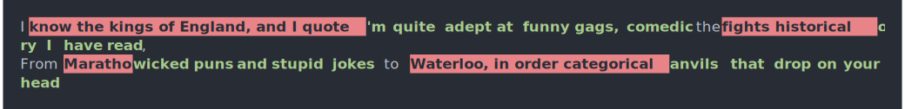
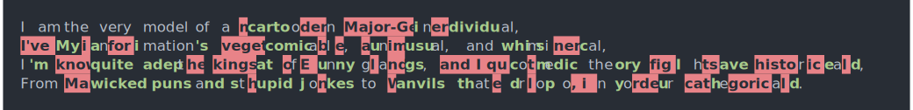

<!-- README.md is generated from README.Rmd. Please edit that file -->

# diffmatchpatch

<!-- badges: start -->
<!-- badges: end -->

`diffmatchpatch` provides an R wrapper for the [STL
variant](https://github.com/leutloff/diff-match-patch-cpp-stl) of
Google’s [diff-match-patch](https://github.com/google/diff-match-patch/)
library.

## Installation

<!--
You can install the released version of diffmatchpatch from [CRAN](https://CRAN.R-project.org) with:

``` r
install.packages("diffmatchpatch")
```
-->

Currently only the development version of this library is available and
can be installed directly from [GitHub](https://github.com/) with:

``` r
# install.packages("devtools")
devtools::install_github("rundel/diffmatchpatch")
```

## Examples

All of the following examples are derived from the demos linked from
Google’s [diffmatchpatch
repo](https://github.com/google/diff-match-patch).

These examples are all run using the default options provided by the
library.

``` asciicast
library(diffmatchpatch)

dmp_options()
```



### diff

These functions compare to text strings and efficiently return a list of
(character level) differences.

``` asciicast
src = "I am the very model of a modern Major-General,
I've information vegetable, animal, and mineral,
I know the kings of England, and I quote the fights historical,
From Marathon to Waterloo, in order categorical."

dest = "I am the very model of a cartoon individual,
My animation's comical, unusual, and whimsical,
I'm quite adept at funny gags, comedic theory I have read,
From wicked puns and stupid jokes to anvils that drop on your head."

diff_make(src, dest)
```


``` asciicast
diff_make(src, dest, cleanup = "efficiency")
```



``` asciicast
diff_make(src, dest, cleanup = "none")
```



### match

### patch
